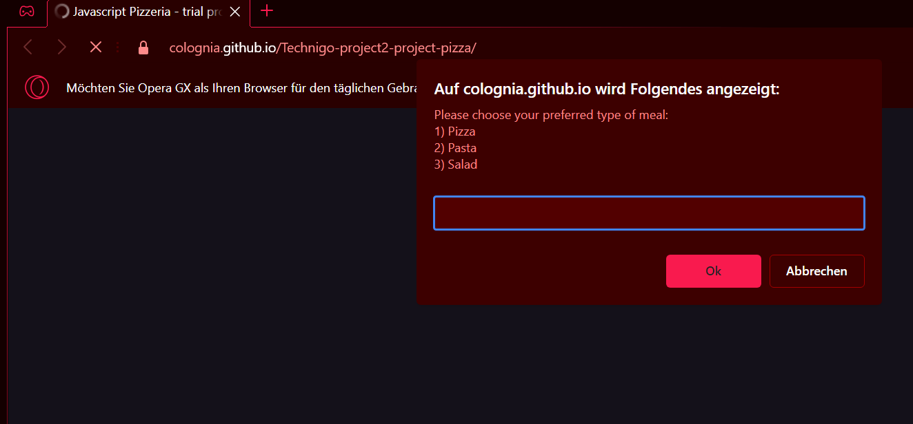

# Technigo web development bootcamp august 2023 - jan 2024: project 2

This is a solution to the second project for the students:
In this project, we're all about mastering vital yet basic JavaScript concepts like variables, conditionals, and native methods. We've ditched web page fuss, giving you a pure coding playground, so you can nail the basics without distractions. Dive into JavaScript logic and amp up your variable game (they're like data containers!) and unleash conditionals for smart choices. You'll even groove with native methods for slick operations.

More details are available in instructions.md .

**What you need to do**

Fullfill the requirements described in step 1-5.

## Table of contents

  - [Overview](#overview)
  - [Screenshot](#screenshot)
  - [Links](#links)
  - [My process](#my-process)
  - [Built with](#built-with)
  - [What I learned](#what-i-learned)
  - [Continued development](#continued-development)
  - [Useful resources](#useful-resources)
  - [Author](#author)

## Overview

2nd challenge for front end developer students.

### Screenshot

.

### Links

- Solution URL: [https://github.com/colognia/Technigo-project2-project-pizza]
- Live Site URL: [https://colognia.github.io/Technigo-project2-project-pizza/]

## My process
- coding one step after the other
- testing every part in browser and in case of problems with console.log and with a validator
- modifying some html and css
- consulting my own notes regarding usage of comandos and other resources

### Built with

- vanilla JS
- Semantic HTML5 markup
- CSS custom properties
- editor: visual studio code

### What I learned

Using different types of loops and condition checking, evaluating user inputs, handling cancel selections from popup boxes thru a triggered error (throw Error).

### Continued development

Writing shorter and more efficient/short code, handling all kinds of unwanted user inputs.

### Useful resources

stackoverflow, W3schools, pythontutor.com for JS as validator

## Author

- Linkedin - (https://www.linkedin.com/in/frauke-s-395242201/)

